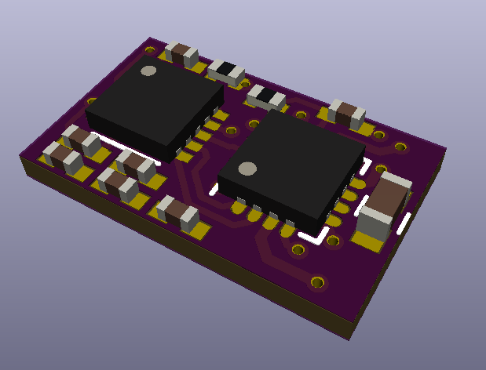
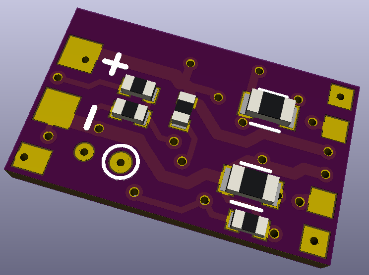

# uStepper

Board for controlling micro stepper motors

## Configuration with RC Transmitter
The uStepper doesn't have any status indicating capabilities like LED. So, to indicate the status of the board while config we will use motor.
Short motor run in one direction and then in another to return to initial position we will name a "beep".
We have three types of beeps: short, medium and long.

To configure the uStepper via RC transmitter, use this sequence:
1. Power off uStepper board.
2. Turn RC Transmitter on and move stick to the MAX position.
3. While stick is in MAX position, power on the uStepper board.
4. uStepper should indicate the config mode with infinite short beeps. Now we in Configuration mode.
5. If board did not swithced to the configuration mode, try to repeat these steps.

In configuration mode we have six menu items:

| Item number | Item name | adjsuting range (real value can be a bit different from calculated)
| ------------ | ------------- | -------------
| 1 | Calibrate RC Transmitter stick range | Determined by MAX position of the stick
| 2 | Adjust motor power level** | 1, 2, 3, 4, 5, 6, 7, 8, 9
| 3 | Board type (SERVO / ESC) | Servo or ESC
| 4 | Adjust SERVO travel range (steps) | 400, 600, 800, 1200, 1600, 2000, 2400, 2800, 3200, 4000 (from min to max)
| 5 | Maximum motor speed | 714Hz, 833Hz, 1000Hz, 1176Hz, 1429Hz, 1667Hz, 1818Hz, 1923Hz, 1961Hz, 2000Hz
| 6 | Dynamic Power | Off, 40%, 60%, 80%
| 7 | Reset settings to default | *

/* Default values are: 
* RC range +-766us from center, center is 1500us.
* Motor power: 3 
* Bard type: Servo
* Servo travel range: 400 steps (from min to max)
* Motor speed: 1429Hz

/** Motor real power depends on many factors. Change the setting and observe the temperature of the motor. 

When we entered Configuration mode (RC Transmitter stick is in MAX), move the stick to the CENTER. 
uStepper will start to cycle between menu items indicating 3 times by N short beeps the number of the menu.
After the last menu it will start from the first one.

To select menu item and start change parameters, move the stick to MAX or MIN depending on the desired result (see below).
If stick left in CENTER for 5 seconds, current settings will be stored to flash (indicated by 2 long beeps) and board will restart.

### 1. Calibrate RC Transmitter stick range

After selecting the menu (stick moved to the CENTER).
1. Wait about 1 second and then move stick to the MAX.
2. uStepper will do a long beep.
3. Move stick back to CENTER and don't touch it.
4. uStepper will record max position and then collect a jitter of RC signal around center.
5. After 5 seconds settings will be stored and board will restart.
 
### 2. Adjust motor power

After selecting the menu (stick moved to the CENTER).
1. To decrease/increase motor power, move stick to MIN/MAX and then back to CENTER.
2. Every change will be confirmed with long beep. If, after chaning setting, no confirmation received, the setting is in it's min or max.
3. Leaving stick in MIN or MAX position will change setting continuously.
4. To finsh adjustment, move rstick back to CENTER.
5. After 5 seconds settings will be stored and board will restart.

### 3. Board type (SERVO / ESC)

After selecting the menu (stick moved to the CENTER).
1. To change mode to Servo, move stick to MIN and then back to CENTER. Setting will be confirmed with one short beep.
2. To change mode to ESC, move stick to MAX and then back to CENTER. Setting will be confirmed with two short beeps.
3. After 5 seconds settings will be stored and board will restart.

### 4. Adjust SERVO travel range

After selecting the menu (stick moved to the CENTER).
1. To decrease/increase travel range, move stick to MIN/MAX and then back to CENTER.
2. Every change will be confirmed with motor run to the MIN/MAX position and back. If, after chaning setting, no confirmation received, the setting is in it's min or max.
3. Leaving stick in MIN or MAX position will change setting continuously.
4. To finsh adjustment, move stick back to CENTER.
5. After 5 seconds settings will be stored and board will restart.
 
### 5. Maximum motor speed

After selecting the menu (stick moved to the CENTER).
1. To decrease/increase maximum motor speed, move stick to MAX/MIN and then back to CENTER.
2. Every change will be confirmed with motor run to the MAX position and back with selected speed. If, after chaning setting, no confirmation received, the setting is in it's min or max.
3. Leaving stick in MIN or MAX position will change setting continuously.
4. To finsh adjustment, move stick back to CENTER.
5. After 5 seconds settings will be stored and board will restart.

### 6. Dynamic motor power

After selecting the menu (stick moved to the CENTER).
1. To decrease/increase dynamic power %, move stick to MAX/MIN and then back to CENTER.
2. Every change will be confirmed with short beeps (1 beep - 0%, 2 beeps - 40%, 3 beeps - 60%, 4 beeps - 80%). If, after chaning setting, no confirmation received, the setting is in it's min or max.
3. Leaving stick in MIN or MAX position will change setting continuously.
4. To finsh adjustment, move stick back to CENTER.
5. After 5 seconds settings will be stored and board will restart.

### 7. Reset settings to default

After selecting the menu (stick moved to the CENTER).
1. Move the stick away from CENTER to MIN or MAX and then back to CENTER.
2. After 5 seconds settings will be restored to factory default and board will restart.

## Latest firmware
[uStepperV2_800.hex with 800 steps range in Servo mode](https://raw.githubusercontent.com/nppc/uStepper-support/master/Bin/uStepperV2_800.hex) (right-click and save link as...)
