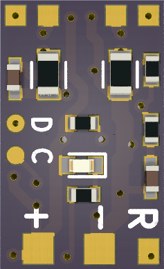
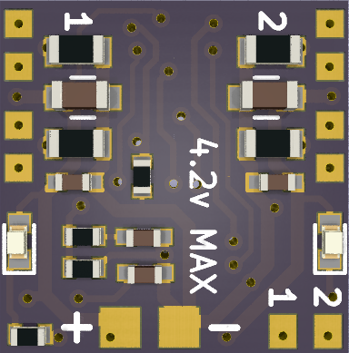

# uStepper

Board for controlling micro stepper motors

[For older version go here](History.md)

| Single board | 2in1 board | 
|-----------|-----------|
| 

 | 

| Top 4 connections for stepper motor. (+) and (-) for Battery 4.2V max. (R) for signal from RC transmitter. | Top 4 connections at left and right edge for 2 stepper motors. (+) and (-) for Battery 4.2V max. (1) and (2) for signals from RC transmitter. | 

## Using uStepper board
When board is powered with transmitter connected, it will do short blink indicating that RC signal is present. If during startup led is always on, then check transmitter connection.

## Configuration with RC Transmitter
The uStepper board has a status indicating LED.
We have three types of blinks: short, medium and long.

To configure the uStepper via RC transmitter, use this sequence:
1. Power off uStepper board.
2. Turn RC Transmitter on and move stick to the MAX position.
3. While stick is in MAX position, power on the uStepper board.
4. uStepper should indicate the config mode with infinite short blinks. Now we in Configuration mode. Please note: for 2in1 board leds will blink for one board then for another.
5. Moving stick back to center will start configuration sequence (see below). For 2in1 board the board that was blinking when stick was centered is selected.
6. If board did not swithced to the configuration mode, try to repeat these steps.

If you want cancel configuration without saving any changes, just remove power from the board.

### configuration sequence
In configuration mode we have seven menu items:

| Item number | Item name | adjsuting range (real value can be a bit different from calculated)
| ------------ | ------------- | -------------
| 1 | Calibrate RC Transmitter stick range | Determined by MAX position of the stick
| 2 | Adjust motor power level** | 1, 2, 3, 4, 5, 6, 7, 8, 9
| 3 | Board type (SERVO / ESC) | Servo or ESC
| 4 | Adjust SERVO travel range (steps) | 400, 600, 800, 1200, 1600, 2000, 2400, 2800, 3200, 4000 (from min to max)
| 5 | Maximum motor speed | 714Hz, 833Hz, 1000Hz, 1176Hz, 1429Hz, 1667Hz, 1818Hz, 1923Hz, 1961Hz, 2000Hz
| 6 | Dynamic Power | Off, 40%, 60%, 80%
| 7 | Reset settings to default | *

/* Default values are: 
* RC range +-766us from center, center is 1500us.
* Motor power: 3 
* Bard type: Servo
* Servo travel range: 400 steps (from min to max)
* Motor speed: 1429Hz

/** Motor real power depends on many factors. Change the setting and observe the temperature of the motor. 

When we entered Configuration mode (RC Transmitter stick is in MAX), move the stick to the CENTER. 
uStepper will start to cycle between menu items indicating 3 times by N short blinks the number of the menu.
After the last menu it will start from the first one.

To select menu item and start change parameters, move the stick to MAX or MIN depending on the desired result (see below).
If stick left in CENTER for 5 seconds, current settings will be stored to flash (indicated by 2 long blinks) and board will restart.

### 1. Calibrate RC Transmitter stick range

After selecting the menu (stick moved to the CENTER).
1. Wait about 1 second and then move stick to the MAX.
2. uStepper will do a long blink. Max position will be recorded.
3. Move stick back to CENTER and don't touch it.
4. uStepper will collect a jitter of RC signal around center and record it.
5. After 5 seconds settings will be stored and board will restart.
 
### 2. Adjust motor power

After selecting the menu (stick moved to the CENTER).
1. To decrease/increase motor power, move stick to MIN/MAX and then back to CENTER.
2. Every change will be confirmed with long blink. If, after chaning setting, no confirmation received, the setting is in it's min or max.
3. Leaving stick in MIN or MAX position will change setting continuously.
4. To finsh adjustment, move stick back to CENTER.
5. After 5 seconds settings will be stored and board will restart.

### 3. Board type (SERVO / ESC)

After selecting the menu (stick moved to the CENTER).
1. To change mode to Servo, move stick to MIN and then back to CENTER. Setting will be confirmed with one short blink.
2. To change mode to ESC, move stick to MAX and then back to CENTER. Setting will be confirmed with two short blink.
3. After 5 seconds settings will be stored and board will restart.

### 4. Adjust SERVO travel range

After selecting the menu (stick moved to the CENTER).
1. To decrease/increase travel range, move stick to MIN/MAX and then back to CENTER.
2. Every change will be confirmed with motor run to the MIN/MAX position and back. If, after chaning setting, no confirmation received, the setting is in it's MIN or MAX.
3. Leaving stick in MIN or MAX position will change setting continuously.
4. To finsh adjustment, move stick back to CENTER.
5. After 5 seconds settings will be stored and board will restart.
 
### 5. Maximum motor speed

After selecting the menu (stick moved to the CENTER).
1. To decrease/increase maximum motor speed, move stick to MAX/MIN and then back to CENTER.
2. Every change will be confirmed with motor run to the MAX position and back with selected speed. If, after chaning setting, no confirmation received, the setting is in it's MIN or MAX.
3. Leaving stick in MIN or MAX position will change setting continuously.
4. To finsh adjustment, move stick back to CENTER.
5. After 5 seconds settings will be stored and board will restart.

### 6. Dynamic motor power

After selecting the menu (stick moved to the CENTER).
1. To decrease/increase dynamic power %, move stick to MAX/MIN and then back to CENTER.
2. Every change will be confirmed with short blink (1 blink - 0%, 2 blinks - 40%, 3 blinks - 60%, 4 blinks - 80%). If, after chaning setting, no confirmation received, the setting is in it's MIN or MAX.
3. Leaving stick in MIN or MAX position will change setting continuously.
4. To finsh adjustment, move stick back to CENTER.
5. After 5 seconds settings will be stored and board will restart.

### 7. Reset settings to default

After selecting the menu (stick moved to the CENTER).
1. Move the stick away from CENTER to MIN or MAX and then back to CENTER.
2. After 5 seconds settings will be restored to factory default and board will restart.

## Changelog
### 17.09.2022
BUG FIXED: with rapid sticks move ESC board refused to reverse the motor.
